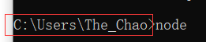
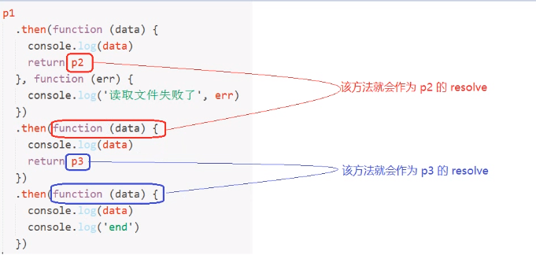

# Node介绍

## 为什么要学习Node.js

- 企业需求
  - 具有服务端开发经验更改
  - front-end
  - back-end
  - 全栈开发工程师
  - 基本的网站开发能力
    - 服务端
    - 前端
    - 运维部署
  - 多人社区

## Node.js是什么

- Node.js是JavaScript 运行时的环境
- 通俗易懂的讲，Node.js是JavaScript的运行平台
- Node.js既不是语言，也不是框架，它是一个平台
- 浏览器中的JavaScript
  - EcmaScript
    - 基本语法
    - if
    - var
    - function
    - Object
    - Array
  - Bom
  - Dom
- Node.js中的JavaScript
  - 没有Bom，Dom
  - EcmaScript
  - 在Node中这个JavaScript执行环境为JavaScript提供了一些服务器级别的API
    - 例如文件的读写
    - 网络服务的构建
    - 网络通信
    - http服务器
- 构建与Chrome的V8引擎之上
  - 代码只是具有特定格式的字符串
  - 引擎可以认识它，帮你解析和执行
  - Google Chrome的V8引擎是目前公认的解析执行JavaScript代码最快的
  - Node.js的作者把Google Chrome中的V8引擎移植出来，开发了一个独立的JavaScript运行时环境
- Node.js uses an envent-driven,non-blocking I/O mode that makes it lightweight and efficent.
  -  envent-driven	事件驱动
  - non-blocking I/O mode   非阻塞I/O模型（异步）
  - ightweight and efficent.   轻量和高效
- Node.js package ecosystem,npm,is the larget scosystem of open sourcr libraries in the world
  - npm 是世界上最大的开源生态系统
  - 绝大多数JavaScript相关的包都存放在npm上，这样做的目的是为了让开发人员更方便的去下载使用
  - npm install jquery
  

## Node能做什么

- web服务器后台
- 命令行工具
  - npm(node)
  - git(c语言)
  - hexo（node）
  - ...
- 对于前端工程师来讲，接触最多的是它的命令行工具
  - 自己写的很少，主要是用别人第三方的
  - webpack
  - gulp
  - npm

## 资源

- 《深入浅出Node.js》
  - 偏理论，几乎没有任何实战行内容，理解原理底层有帮助，结合课程的学习去看
- 《Node.js权威指南》
  - API讲解，也没有业务，没有实战
- JavaScript标准参考教程(alpha) : https://wangdoc.com/javascript/index.html
- Node入门: http://www.nodebeginner.org/index-zh-cn.html
- 官方API文档: https://odejs.org/dist/latest-v6.x/docs/api/
- 中文文档(版本比较旧，凑合看)↓http://www.nodeclass.com/api/node.html
- CNODE社区: http://cnodejs.org
- CNODE-新手入门: http://cnodejs.org/getstart

## 学习内容

- B/S编程模型
  - Browser - Server
  - back-end
  - 任何服务端技术这种BS编程模型都是一样，和语言无关，Node只是作为我们学习BS编程模型的一个工具而已
- 模块化编程
  - Require]S
  - SeaJS
  - @`import('文件路径')`
  - 以前认知的JavaScript只能通过script 标签来加载，在Node中可以像@import() 一 样来引用加载JavaScript脚本文件
- Node常 用API
  - 异步编程
  - 回调函数
  - Promise
  - async
  - generator
- Express Web开发框架
- Ecmascript 6
  

# 初识别Node

## 安装Node环境

- 查看Node环境的版本号
- 下载：https://nodejs.org/en/
- 安装：
  - 傻瓜式安装，一路`next`
  - 安装过再次安装会升级
- 确认Node环境是否安装成功
  - 查看node的版本号：`node --version`
  - 或者`node -v`
- 配置环境变量

## 执行node.js文件

1. 创建编写JavaScript脚本文件
2. 打开终端，定位脚本文件的所属目录
3. 输入`node 文件名`执行对应的文件

注意：文件名不要用`node.js`来命名，也就是说除了`node`这个名字随便起，最好不要使用中文。

## 使用模块

### 文件的读写

​		浏览器中的 JavaScript 是没有文件操作的能力的，但是 Node 中的 JavaScript 具有文件操作的能力

​		fs 是 file-system 的简写，就是文件系统的意思，在 Node 中如果想要进行文件操作，就必须引入 fs 这个核心模块

​		在 fs 这个核心模块中，就提供了所有的文件操作相关的 API，例如：`fs.readFile` 就是用来读取文件的

**文件读取:**

```javascript

// 1. 使用 require 方法加载 fs 核心模块
var fs = require('fs')

// 2. 读取文件
//    第一个参数就是要读取的文件路径
//    第二个参数是一个回调函数
//          
//        成功
//          data 数据
//          error null
//        失败
//          data undefined没有数据
//          error 错误对象
fs.readFile('./data/a.txt', function (error, data) {
  // <Buffer 68 65 6c 6c 6f 20 6e 6f 64 65 6a 73 0d 0a>
  // 文件中存储的其实都是二进制数据 0 1
  // 这里为什么看到的不是 0 和 1 呢？原因是二进制转为 16 进制了
  // 但是无论是二进制01还是16进制，人类都不认识
  // 所以我们可以通过 toString 方法把其转为我们能认识的字符


  // 在这里就可以通过判断 error 来确认是否有错误发生
  if (error) {
    console.log('读取文件失败了')
  } else {
    console.log(data.toString())
  }
})

```

​		除了使用`data.toString()`将其转换为我们认识的字符外，readFile的第二个参数是可选的，传入utf8，可将读取到的文件直接按照utf8编码转换成我们认识的字符，得到的date是字符串。

```javascript
fs.readFile('./data/a.txt', utf8, function (error, data) {
  
  if (error) {
    console.log('读取文件失败了')
  } else {
    console.log(data)
  }
})
```

**文件写入：**

```javascript
var fs = require('fs')

// 第一个参数：文件路径
// 第二个参数：文件内容
// 第三个参数：回调函数
//    error
//    
//    成功：
//      文件写入成功
//      error 是 null
//    失败：
//      文件写入失败
//      error 就是错误对象
fs.writeFile('./data/你好.md', '大家好，给大家介绍一下，我是Node.js', function (error) {

  if (error) {
    console.log('写入失败')
  } else {
    console.log('写入成功了')
  }
})

```

### Http服务器

#### 创建一个http服务器

​		可以使用 Node 非常轻松的构建一个 Web 服务器，在 Node 中专门提供了一个核心模块：**http**
​		**http** 这个模块的职责就是帮你创建编写服务器的

创建http服务器步骤：

1. 加载 http 核心模块
2. 使用 http.createServer() 方法创建一个 Web 服务器， 返回一个 Server 实例
3. 创建服务器需要做的事情，注册 request 请求事件，当客户端请求过来，就会自动触发服务器的 request 请求事件，然后执行第二个参数：回调处理函数
4. 绑定端口号，启动服务器

```javascript

// 1. 加载 http 核心模块
var http = require('http')

// 2. 使用 http.createServer() 方法创建一个 Web 服务器
//    返回一个 Server 实例
var server = http.createServer()

// 3. 服务器要干嘛？
//    提供服务：对 数据的服务
//    发请求
//    接收请求
//    处理请求
//    给个反馈（发送响应）
//    注册 request 请求事件
//    当客户端请求过来，就会自动触发服务器的 request 请求事件，然后执行第二个参数：回调处理函数
server.on('request', function () {
  console.log('收到客户端的请求了')
})

// 4. 绑定端口号，启动服务器
server.listen(3000, function () {
  console.log('服务器启动成功了，可以通过 http://127.0.0.1:3000/ 来进行访问')
})
```

#### 与客户端简单交互		

request 请求事件处理函数，需要接收两个参数：

- Request （req）请求对象：请求对象可以用来获取客户端的一些请求信息，例如请求路径
- Response（res) 响应对象：响应对象可以用来给客户端发送响应消息

```javascript
server.on('request', function (req, res) { 

}
```

​		response 对象有一个方法：write 可以用来给客户端发送响应数据,write 可以使用多次，但是最后一定要使用 end 来结束响应，否则客户端会一直等待。

```javascript
 response.write('hello')

 response.end()
```

​		上面的方式比较麻烦，推荐使用更简单的方式，`res.end(‘发送内容’)`，直接end的同时发送响应数据，支持两种数据类型，一种是二进制，一种是字符串

```javascript
res.end('hello nodejs')  
```

根据不同的请求路径发送不同的响应结果

1. 获取请求路径：`req.url` 获取到的是端口号之后的那一部分路径，也就是说所有的 url 都是以 / 开头的
2. 判断路径处理响应，响应内容只能是：二进制数据、字符串、数字、对象、数组、布尔值

```javascript
var http = require('http')

// 1. 创建 Server
var server = http.createServer()

// 2. 监听 request 请求事件，设置请求处理函数
server.on('request', function (req, res) {
  console.log('收到请求了，请求路径是：' + req.url)
  console.log('请求我的客户端的地址是：', req.socket.remoteAddress, req.socket.remotePort)
  res.setHeader('Content-Type', 'text/palin; charset=utf-8');  // 设置请求头


  var url = req.url

  if (url === '/') {
    res.end('index page')
  } else if (url === '/login') {
    res.end('login page')
  } else if (url === '/products') {
    var products = [{
        name: '苹果 X',
        price: 8888
      },
      {
        name: '菠萝 X',
        price: 5000
      },
      {
        name: '小辣椒 X',
        price: 1999
      }
    ]


    res.end(JSON.stringify(products))
  } else {
    res.end('404 Not Found.')
  }
})

// 3. 绑定端口号，启动服务
server.listen(3000, function () {
  console.log('服务器启动成功，可以访问了。。。')
})
```

补充js中的JSON转换：

-  json对象转化为字符串类型的json
  - `JSON.stringify()`
- json类型的字符串转化为json对象  两种方法：
  - `eval()`
  - `JSON.parse()`

#### 简写的方式

简写的方式来实现与客户端的交互

```javascript
var http = require('http')

http
    .createServer(function(req, res){
    res.end("hello")
    })
    .listen(3000,function(){
        console.log('running...')
    })
```

### 加载与导出模块


#### 加载`require`

语法：

~~~java
var 自定义变量名 = require('模块')
~~~

作用：

- 执行被加载模块中的代码
- 得到被加载模块中的`exports`导出接口对象

#### 导出`exports`

语法

在需要导出的变量前加上exports:

~~~java
exports.a = 123;
~~~

#### 示例

希望在a.js中使用b.js中的内容

a.js

```javascript
var bExports = require('./b')
var fs = require('fs')

console.log(bExports.foo)

console.log(bExports.add(10, 30))

console.log(bExports.age)

bExports.readFile('./a.js')

fs.readFile('./09-简单的模块化/加载与导出/a.js', function (err, data) {
  if (err) {
    console.log('读取文件失败')
    console.log(err)
  } else {
    console.log(data.toString())
  }
})

```

b.js

```javascript
var foo = 'bbb'

// console.log(exports)

exports.foo = 'hello'

exports.add = function (x, y) {
  return x + y
}

exports.readFile = function (path, callback) {
  console.log('文件路径：', path)
}

var age = 18

exports.age = age

function add(x, y) {
  return x - y
}
```

# Web服务器开发

## IP与端口

​		所有联网的程序都需要进行网络通信，计算机中只有一个物理网卡，而且同一个局域网中，网卡的地址必须是唯一的。网卡是通过唯一的 ip地址来进行定位的。

ip：地址用来定位计算机

端口号：用来定位具体的应用程，所有需要联网通信的应用程序都会占用一个端口号。

​		端口号的范围从0- 65536之间。可以同时开启多个服务，但一定要确保不同服务占用的端口号不一致才可以，即在一台计算机中，同一个端口号同一时间只能被一个程序占用。

## 响应内容类型（Content-type）

​		在服务端默认发送的数据，其实是 utf8 编码的内容，但是浏览器不知道你是 utf8 编码的内容，浏览器在不知道服务器响应内容的编码的情况下会按照当前操作系统的默认编码去解析。

​		中文操作系统默认是 gbk，解决方法就是正确的告诉浏览器我给你发送的内容是什么编码的

​		 在 http 协议中，Content-Type 就是用来告知对方我给你发送的数据内容是什么类型

```javascript
 res.setHeader('Content-Type', 'text/plain; charset=utf-8')
```

示例

```javascript
var http = require('http')

var server = http.createServer()

server.on('request', function (req, res) {

  var url = req.url

  if (url === '/plain') {
    // text/plain 就是普通文本
    res.setHeader('Content-Type', 'text/plain; charset=utf-8')
    res.end('hello 世界')
  } else if (url === '/html') {
    // 如果你发送的是 html 格式的字符串，则也要告诉浏览器我给你发送是 text/html 格式的内容
    res.setHeader('Content-Type', 'text/html; charset=utf-8')
    res.end('<p>hello html <a href="">点我</a></p>')
  }
})

server.listen(3000, function () {
  console.log('Server is running...')
})
```

​		结合 fs 发送文件中的数据至客户端， 不同的资源对应的 Content-Type 是不一样的。Content-Type对照表：http://tool.oschina.net/commons

​		图片不需要指定编码，一般只为字符数据才指定编码

​		url：统一资源定位符。一个 url 最终其实是要对应到一个资源的

​		除了Content-Type可以用来指定编码，也可以在HTML页面中通过meta元数据来声明当前文本的编码格式，浏览器也会识别它。

```html
<meta charset="UTF-8">
```

##  JS编程规范

参考链接：https://www.ctolib.com/mip/getjll-JavaScript-Style-Guide.html

### 分号问题

当你采用了无分号的代码风格的时候，只需要注意以下情况就不会有上面的问题了：

  当一行代码是以：

- ​    (
- ​    [
- ​    `

  开头的时候，则在前面补上一个分号;用以避免一些语法解析错误。有些人也喜欢玩儿一些花哨的东西，例如可以使用 ! ~ 等。

`：是 EcmaScript 6 中新增的一种字符串包裹方式，叫做：模板字符串，它支持换行和非常方便拼接变量

### return的作用

return 有两个作用：1.方法返回值；2.阻止代码继续往后执行

### ==与===

双等号==（相等运算符）：表示值相等则都为true

三等号===（严格运算符）:表示 不仅要值相等，双方类型也要相等才为true

## 模拟Apache

​		将模板文件全部放在一个文件夹中，例如`D:/Movie/www`中，默认 `var filePath = '/index.html'`，当输入url改变filePath，实现动态读取。

```javascript
var http = require('http')
var fs = require('fs')

var server = http.createServer()

var wwwDir = 'D:/Movie/www'

server.on('request', function (req, res) {
  var url = req.url  

  var filePath = '/index.html'
  if (url !== '/') {
    filePath = url
  }

  fs.readFile(wwwDir + filePath, function (err, data) {
    if (err) {
      return res.end('404 Not Found.')
    }
    res.end(data)
  })
})

// 3. 绑定端口号，启动服务
server.listen(3000, function () {
  console.log('running...')
})
```

### 读取文件目录

使用`fs.readdir`

```javascript
var fs = require('fs')

fs.readdir('路径', function (err, files) {
  if (err) {
    return console.log('目录不存在')
  }
  console.log(files)
})
```

## 模板引擎art-template

### art-template

官方地址：https://aui.github.io/art-template/zh-cn/docs/index.html

art-template 不仅可以在浏览器使用，也可以在 node 中使用

安装：

- npm install art-template
- 该命令在哪执行就会把包下载到哪里。默认会下载到 node_modules 目录中
- node_modules 不要改，也不支持改。

在 Node 中使用 art-template 模板引擎，模板引起最早就是诞生于服务器领域，后来才发展到了前端。

❗强调：模板引擎不关心你的字符串内容，只关心自己能认识的模板标记语法，例如 {{}}。哪怕`'{{ }}'`是这样的形势，`{{ }}`中的内容也可被替换。

{{}} 语法被称之为 mustache 语法，八字胡语法。

### 在node.js中使用

1. 安装 npm install art-template
2. 在需要使用的文件模块中加载 art-template
   - 只需要使用 require 方法加载就可以了：require('art-template')
   - 参数中的 art-template 就是你下载的包的名字，也就是说你 isntall 的名字是什么，则你 require 中的就是什么
3. 查文档，使用模板引擎的 API。使用`template.render(data.toString(模板字符串), {替换对象})`

在tpl.html中编写前端页面代码，留下需要替换的`{{}}`

```html
<!DOCTYPE html>
<html lang="en">
<head>
  <meta charset="UTF-8">
  <title>{{ title }}</title>
</head>
<body>
  <p>大家好，我叫：{{ name }}</p>
  <p>我今年 {{ age }} 岁了</p>
  <h1>我来自 {{ province }}</h1>
  <p>我喜欢：{{each hobbies}} {{ $value }} {{/each}}</p>
  <script>
    var foo = '{{ title }}'
  </script>
</body>
</html>
```

在js文件中编写后端代码，替换tpl.html中的内容

```javascript
var template = require('art-template')
var fs = require('fs')


fs.readFile('./tpl.html', function (err, data) {
  if (err) {
    return console.log('读取文件失败了')
  }
  // 默认读取到的 data 是二进制数据
  // 而模板引擎的 render 方法需要接收的是字符串
  // 所以我们在这里需要把 data 二进制数据转为 字符串 才可以给模板引擎使用
  var ret = template.render(data.toString(), {
    name: 'Jack',
    age: 18,
    province: '北京市',
    hobbies: [
      '写代码',
      '唱歌',
      '打游戏'
    ],
    title: '个人信息'
  })

  console.log(ret)
})

```

### 在前端中使用art-template

1. 引入模块`<script src="node_modules/art-template/lib/template-web.js"></script>`
2. 给script标签设置type="text/template"属性，标签里的内容不会被执行，也不会显示在页面上，但是可以在另外一个script里面通过获取插入到页面上。这样可以把大段的html和js进行分离。

```html
<!DOCTYPE html>
<html lang="en">
<head>
  <meta charset="UTF-8">
  <title>06-在浏览器中使用art-template</title>
</head>
<body>
  <!-- 
    注意：在浏览器中需要引用 lib/template-web.js 文件
   -->
  <script src="node_modules/art-template/lib/template-web.js"></script>
  <script type="text/template" id="tpl">
    <!DOCTYPE html>
    <html lang="en">
    <head>
      <meta charset="UTF-8">
      <title>Document</title>
    </head>
    <body>
      <p>大家好，我叫：{{ name }}</p>
      <p>我今年 {{ age }} 岁了</p>
      <h1>我来自 {{ province }}</h1>
      <p>我喜欢：{{each hobbies}} {{ $value }} {{/each}}</p>
    </body>
    </html>
  </script>
  <script>
    var ret = template('tpl', {
      name: 'Jack',
      age: 18,
      province: '北京市',
      hobbies: [
        '写代码',
        '唱歌',
        '打游戏'
      ]
    })

    console.log(ret)
  </script>
</body>
</html>
```

### 客户端渲染

流程：

1. 客户端收到服务端响应的字符串（html代码）
2. 从上到下解析，如果发现ajax请求，则再次发起洗呢请求
3. 发送新的请求，拿到ajax响应结果
4. 模板引擎渲染

一共发生两次请求：

1. 第一次请求拿到的是页面.
2. 第二次请求拿到的是动态数据

### 服务端渲染

流程：

1. 读取模板字符串
2. 在服务端对模板进行渲染。在发送给客户端之前，在服务端就已经把模板渲染处理了

对于服务端道染来讲，只请求了一次。

### 客户端和服务端渲染的不同

服务端渲染和客户端渲染的区别

- 客户端渲染不利于SEO搜索引擎优化
- 服务端渲染是可以被爬虫抓取到的，客户端异步渲染是很难被爬虫抓取到的

真正的网站既不是纯异步也不是纯服务端渲染出来的，而是两者结合来做的

## 模板继承

官方文档：[https://aui.github.io/art-template/zh-cn/docs/syntax.html#%E6%A8%A1%E6%9D%BF%E7%BB%A7%E6%89%BF](https://aui.github.io/art-template/zh-cn/docs/syntax.html#模板继承)

在模板中留下位置，

```html
{{block 'head'}} 默认内容 {{/block}}
```

在需要继承模板的页面，引入模板，并替换留下位置中的内容

```html
{{extend './layout.art'}}
{{block 'head'}} ... {{/block}}
```

## 子模版

页面中的头部或者底部样式都是类似的，可以使用子模版引入

```html
{{include '子模版路径'}}
```

## Url模块

### parse函数		

​		由于GET请求直接被嵌入在路径中，URL是完整的请求路径，包括了?后面的部分，因此你可以手动解析后面的内容作为GET请求的参数。

​		url 模块中的 parse 函数可以用于解析url中的参数。

`url.parse(urlStr, [parseQueryString], [slashesDenoteHost])`

参数使用说明如下：

- **urlStr** - 需要接收的url字符串。
- **parseQueryString** - 为true时将使用查询模块分析查询字符串，表示直接将查询字符串转为一个对象。默认为false。
- **shashesDenoteHost**    

​     -默认为false，//foo/bar 形式的字符串将被解释成 { pathname: ‘//foo/bar' }

​     -如果设置成true，//foo/bar 形式的字符串将被解释成 { host: ‘foo', pathname: ‘/bar' }

```javascript
var url = require('url')

var obj = url.parse('localhost:3000/user?name=dragon&age=18',true)
console.log(obj)
console.log(obj.query)  //通过query获取查询字符串

// 直接使用obj.query会在前面有[Object: null prototype]
// 所以需要用json处理下
dic = JSON.stringify(obj.query)
console.log(JSON.parse(dic))
```

运行结果  

```
Url {
  protocol: 'localhost:',
  slashes: null,
  auth: null,
  host: '3000',
  port: null,
  hostname: '3000',
  hash: null,
  search: '?name=dragon&age=18',
  query: [Object: null prototype] { name: 'dragon', age: '18' },
  pathname: '/user',
  path: '/user?name=dragon&age=18',
  href: 'localhost:3000/user?name=dragon&age=18'
}
[Object: null prototype] { name: 'dragon', age: '18' }
{ name: 'dragon', age: '18' }
```

### format函数

format函数的作用与parse相反，它的参数是一个JSON对象，返回一个组装好的url地址，请看如下示例：

```javascript
var url = require('url')

path = url.format({
protocol: 'http:',
hostname:'www.baidu.com',
port:'80',
pathname :'/news',
query:{page:1}
});

console.log(path)
```

运行结果

```
http://www.baidu.com:80/news?page=1
```

### resolve函数

resolve函数的参数是两个路径，第一个路径是开始的路径或者说当前路径，第二个则是想要去往的路径，返回值是一个组装好的url，示例如下：

```javascript
var url = require('url')
path = url.resolve('http://example.com/', '/one')

console.log(path)
```

运行结果

```
http://example.com/one
```

## 反馈平台开发

项目结构

```
feedback
├─ app.js
├─ package-lock.json
├─ public
│  ├─ css
│  │  └─ main.css
│  ├─ img
│  │  └─ ab3.jpg
│  ├─ js
│  │  └─ main.js
│  └─ lib
│     └─ bootstrap
│        ├─ bootstrap.css
│        ├─ CHANGELOG.md
│        ├─ Gruntfile.js
│        ├─ LICENSE
│        ├─ package.json
│        └─ README.md
└─ views
   ├─ 404.html
   ├─ index.html
   └─ post.html
```

- public文件夹：放置公共资源js、css、img等
- views文件夹：放置tml页面
- app.js：服务端node.js代码

​       app application 应用程序，把当前模块所有的依赖项都声明再文件模块最上面。

​		为了让目录结构保持统一清晰，所以我们约定，把所有的 HTML 文件都放到 views（视图） 目录中，我们为了方便的统一处理这些静态资源，所以我们约定把所有的静态资源都存放在 public 目录中，哪些资源能被用户访问，哪些资源不能被用户访问，我现在可以通过代码来进行非常灵活的控制。

app.js服务端代码

```js
var http = require('http')
var fs = require('fs')
var url = require('url')
var template = require('art-template')

var comments = [
  {
    name: '张三',
    message: '今天天气不错！',
    dateTime: '2015-10-16'
  },
  {
    name: '张三2',
    message: '今天天气不错！',
    dateTime: '2015-10-16'
  },
  {
    name: '张三3',
    message: '今天天气不错！',
    dateTime: '2015-10-16'
  },
  {
    name: '张三4',
    message: '今天天气不错！',
    dateTime: '2015-10-16'
  },
  {
    name: '张三5',
    message: '今天天气不错！',
    dateTime: '2015-10-16'
  }
]

// /pinglun?name=的撒的撒&message=的撒的撒的撒
// 对于这种表单提交的请求路径，由于其中具有用户动态填写的内容
// 所以你不可能通过去判断完整的 url 路径来处理这个请求
// 
// 结论：对于我们来讲，其实只需要判定，如果你的请求路径是 /pinglun 的时候，那我就认为你提交表单的请求过来了

http
  .createServer(function (req, res) { // 简写方式，该函数会直接被注册为 server 的 request 请求事件处理函数
    // 使用 url.parse 方法将路径解析为一个方便操作的对象，第二个参数为 true 表示直接将查询字符串转为一个对象（通过 query 属性来访问）
    var parseObj = url.parse(req.url, true)

    // 单独获取不包含查询字符串的路径部分（该路径不包含 ? 之后的内容）
    var pathname = parseObj.pathname

    if (pathname === '/') {
      fs.readFile('./views/index.html', function (err, data) {
        if (err) {
          return res.end('404 Not Found.')
        }
        var htmlStr = template.render(data.toString(), {
          comments: comments
        })
        res.end(htmlStr)
      })
    } else if (pathname === '/post') {
      // 其它的都处理成 404 找不到
      fs.readFile('./views/post.html', function (err, data) {
        if (err) {
          return res.end('404 Not Found.')
        }
        res.end(data)
      })
    } else if (pathname.indexOf('/public/') === 0) {
      // /public/css/main.css
      // /public/js/main.js
      // /public/lib/jquery.js
      // 统一处理：
      //    如果请求路径是以 /public/ 开头的，则我认为你要获取 public 中的某个资源
      //    所以我们就直接可以把请求路径当作文件路径来直接进行读取
      fs.readFile('.' + pathname, function (err, data) {
        if (err) {
          return res.end('404 Not Found.')
        }
        res.end(data)
      })
    } else if (pathname === '/pinglun') {
      // 注意：这个时候无论 /pinglun?xxx 之后是什么，我都不用担心了，因为我的 pathname 是不包含 ? 之后的那个路径
      // 一次请求对应一次响应，响应结束这次请求也就结束了
      // res.end(JSON.stringify(parseObj.query))

      // 我们已经使用 url 模块的 parse 方法把请求路径中的查询字符串给解析成一个对象了
      // 所以接下来要做的就是：
      //    1. 获取表单提交的数据 parseObj.query
      //    2. 将当前时间日期添加到数据对象中，然后存储到数组中
      //    3. 让用户重定向跳转到首页 /
      //       当用户重新请求 / 的时候，我数组中的数据已经发生变化了，所以用户看到的页面也就变了
      var comment = parseObj.query
      comment.dateTime = '2017-11-2 17:11:22'
      comments.unshift(comment)
      // unshift将一个或多个新元素添加到数组开始，数组中的元素自动后移，返回数组新长度 
      // 服务端这个时候已经把数据存储好了，接下来就是让用户重新请求 / 首页，就可以看到最新的留言内容了

      // 如何通过服务器让客户端重定向？
      //    1. 状态码设置为 302 临时重定向
      //        statusCode
      //    2. 在响应头中通过 Location 告诉客户端往哪儿重定向
      //        setHeader
      // 如果客户端发现收到服务器的响应的状态码是 302 就会自动去响应头中找 Location ，然后对该地址发起新的请求
      // 所以你就能看到客户端自动跳转了
      res.statusCode = 302
      res.setHeader('Location', '/')
      res.end()
    } else {
      // 其它的都处理成 404 找不到
      fs.readFile('./views/404.html', function (err, data) {
        if (err) {
          return res.end('404 Not Found.')
        }
        res.end(data)
      })
    }
  })
  .listen(3000, function () {
    console.log('running...')
  })
```

### 关于重定向

-  状态码设置为 302 临时重定向
  -  statusCode
- 在响应头中通过 Location 告诉客户端往哪儿重定向
  - setHeader
- 如果客户端发现收到服务器的响应的状态码是 302 就会自动去响应头中找 Location ，然后对该地址发起新的请求，所以你就能看到客户端自动跳转了

```
res.statusCode = 302
res.setHeader('Location', '/')
res.end()
```

状态码301与302

301：永久重定向，浏览器会记住此处重定向，例如a重定向到b，下次不会访问a，直接访问b

302：临时重定向，浏览器不会记住，访问a之后，再告诉浏览器去访问b

# Node中的模块系统

使用Node编写应用程序主要就是在使用：

- EcmaScript语言
  - 和浏览器一样，在Node中没有Bom和Dom
- 核心模块：Node为JavaScript提供了很多服务器级别的API，这些API绝大多数都被包装到了一个具名的核心模块中了。
  - 文件操作的fs
  - http服务操作的http
  - url路径操作模块
  - path路径处理模块
  - os操作系统信息
- 第三方模块
  - art-template
  - 必须通过npm来下载才可以使用
- 自己写的模块
  - 自己创建的文件

在 Node 中，没有全局作用域，只有模块作用域

- 外部访问不到内部
- 内部也访问不到外部
- 默认都是封闭的

​        既然是模块作用域，那如何让模块与模块之间进行通信？有时候，我们加载文件模块的目的不是为了简简单单的执行里面的代码，更重要是为了使用里面的某个成员。

## 什么是模块化

- 文件作用域(模块是独立的，在不同的文件使用必须要重新引用)【在node中没有全局作用域，它是文件模块作用域】
- 通信规则
  - 加载require
  - 导出exports

## CommonJS模块规范

在Node中的JavaScript还有一个重要的概念，模块系统。

1. 模块作用域
2. 使用require方法来加载模块
3. 使用exports接口对象来导出模板中的成员

​		模块作用域固然带来了一些好处，可以加载执行多个文件，可以完全避免变量命名冲突污染的问题，但是某些情况下，模块与模块是需要进行通信的。

​		在每个模块中，都提供了一个对象:`exports`该对象默认是一个空对象，把需要被外部访问使用的成员手动的挂载到、`exports`接口对象中。

​		然后谁来`require` 这个模块，谁就可以得到模块内部的，exports接口对象

### 加载`require`

语法：

~~~java
var 自定义变量名 = require('模块')
~~~

作用：

- 执行被加载模块中的代码
- 得到被加载模块中的`exports`导出接口对象

加载用户自定义模块

- 相对路径必须加 ./ 不可省略
- 可以省略后缀名

### 导出`exports`

Node中是模块作用域，默认文件中所有的成员只在当前模块有效

对于希望可以被其他模块访问到的成员，我们需要把这些公开的成员都挂载到`exports`接口对象中就可以了

**导出多个成员（必须在对象中）：**

```javascript
exports.xxx = xxx

exports.a = 123;
exports.b = function(){
    console.log('bbb')
};
exports.c = {
    foo:"bar"
};
exports.d = 'hello';
```

**导出单个成员（拿到的就是函数，字符串）：**

```javascript
module.exports = xxx

module.exports = 'hello';
```

以下情况会覆盖：

```javascript
module.exports = 'hello';

//后者会覆盖前者
module.exports = function add(x,y) {
    return x+y;
}
```

**也可以通过以下方法来导出多个成员：**

```javascript
module.exports = {
					}

module.exports = {
  a: "hello",
  add: function () {
    return x + y;
  },
};
```

### 模块原理

​		在 Node 中，每个模块内部都有一个自己的 module 对象，该 module 对象中，有一个成员叫：`exports` 也是一个对象，也就是说如果你需要对外导出成员，只需要把导出的成员挂载到 `module.exports` 中

​		我们发现，每次导出接口成员的时候都通过 `module.exports.xxx = xxx` 的方式很麻烦，点儿的太多了，所以，Node 为了简化操作，专门提供了一个变量：`exports` ，`var exports = module.exports`,那就说明，我可以使用任意一方来导出内部成员

```javascript
console.log(exports === module.exports)  // 结果为true

exports.foo = 'bar'
// 等价于
module.exports.foo = 'bar'
```

​		`var exports = module.exports`，说明`export`只是`module.exports`的一个引用，所以`exports`即使重新赋值,也不会影响`module.exports`。

​		当一个模块需要导出单个成员的时候，直接给 exports 赋值，使得exports指向了一个新的对象，不再指向`module.exports`，因此无法使用 `export=1`这种方式来获取单个成员

​		谁来 require 这个文件，谁就得到 module.exports，默认在代码的最后有一句：

```javascript
renturn module.exports
```

​		⭕一定要记住，模块最终向外 return 的是 `module.exports`，不是 `exports`，所以你给 `exports` 重新赋值不管用。

​		给 `exports` 赋值会断开和 `module.exports` 之间的引用，同理，给 `module.exports` 重新赋值也会断开

```javascript
module.exports = 'hello'

exports.foo  = 'world'

//返回结果为：hello
```

​		`module.exports`指向hello，而`exports`重新指向了world，不在是`module.exports`的引用，return的是`module.exports`，所以只返回hello

​		可以用`exports = module.exports`重新建立联系，

```javascript
// 这里导致 exports !== module.exports
module.exports = {
  foo: 'bar'
}

//  但是这里又重新建立两者的引用关系
exports = module.exports

exports.foo = 'hello'

//返回结果为：hello
```

示例

```javascript
// {foo: bar}
exports.foo = 'bar'


// {foo: bar, a: 123}
module.exports.a = 123

// exports !== module.exports
// 最终 return 的是 module.exports
// 所以无论你 exports 中的成员是什么都没用
exports = {
  a: 456
}

// {foo: 'haha', a: 123}
module.exports.foo = 'haha'

// 没关系，混淆你的
exports.c = 456

// 重新建立了和 module.exports 之间的引用关系了
exports = module.exports

// 由于在上面建立了引用关系，所以这里是生效的
// {foo: 'haha', a: 789}
exports.a = 789

// 前面再牛逼，在这里都全部推翻了，重新赋值
// 最终得到的是 Function
module.exports = function () {
  console.log('hello')
}
```

# require的加载规则

- 核心模块

  - 模块名

- 第三方模块

  - 模块名

- 用户自己写的

  - 路径


## 加载规则

### 优先从缓存加载

​		如果从加载的js文件中已经包含了需要加载的其他模块，例如main.js需要加载a.js和b.js，但再a.js中已经加载了b.js，则main.js中不会重复加载b.js，可以拿到b.js中的接口对象。

设定a.js、b.js和main.js，

```
03-require优先从缓存加载
├─ a.js
├─ b.js
└─ main.js
```

main.js中引入a.js和b.js

```javascript
require('./a')

// 优先从缓存加载
// 由于 在 a 中已经加载过 b 了
// 所以这里不会重复加载
// 可以拿到其中的接口对象，但是不会重复执行里面的代码
// 这样做的目的是为了避免重复加载，提高模块加载效率
var fn = require('./b')

console.log(fn)
```

a.js中引入b.js

```javascript
console.log('a.js 被加载了')
var fn = require('./b')

console.log(fn)
```

b.js

```javascript
console.log('b.js 被加载了')

module.exports = function () {
  console.log('hello bbb')
}
```

运行main.js结果为

```
a.js 被加载了
b.js 被加载了
[Function]
[Function]
```

### 判断模块标识符

#### 路径形式的模块

以路径形式加载的模块为自定义模块

-  ./ 当前目录，不可省略
-  ../ 上一级目录，不可省略
-  /xxx 几乎不用，首位的 / 在这里表示的是当前文件模块所属磁盘的根路径
-  d:/a/foo.js ，绝对路径几乎不用
-  .js 后缀名可以省略

```javascript
require('./foo')
```

#### 核心模块

核心模块的本质也是文件

核心模块文件已经被编译到了二进制文件中了，我们只需要按照名字来加载就可以了

```javascript
require('fs')

require('http')
```

#### 第三方模块

​		凡是第三方模块都必须通过 npm 来下载，使用的时候就可以通过 `require('包名')` 的方式来进行加载才可以使用。不可能有任何一个第三方包和核心模块的名字是一样的，第三方模块既不是核心模块、也不是路径形式的模块

```javascript
var template = require('art-template');
```

加载第三方模块方式

1. 先找到当前文件所处目录中的 node_modules 目录
2. node_modules/art-template
3. node_modules/art-template/package.json 文件
4. node_modules/art-template/package.json 文件中的 main 属性
5. main 属性中就记录了 art-template 的入口模块
6. 最后加载使用这个第三方包
7. 实际上最终加载的还是文件

​         如果 package.json 文件不存在或者 main 指定的入口模块是也没有，则 node 会自动找该目录下的 `index.js`，也就是说 `index.js` 会作为一个默认备选项。

  		如果以上所有任何一个条件都不成立，则会进入上一级目录中的 node_modules 目录查找， 如果上一级还没有，则继续往上上一级查找。如果直到当前磁盘根目录还找不不到，最后报错：`can not find module xxx`

注意：我们一个项目有且只有一个 node_modules，放在项目根目录中，这样的话项目中所有的子目录中的代码都可以加载到第三方，不会出现有多个 node_modules

### 模块查找机制

1. 优先从缓存加载
2. 核心模块
3. 路径形式的文件模块
4. 第三方模块


# npm

- node package manage(node包管理器)
- 通过npm命令安装jQuery包（`npm install jquery --save` ），在安装时加上--save会主动生成说明书文件信息（将安装文件的信息添加到`package.json`里面）

## npm网站

> ​	https://www.npmjs.com/	网站是用来搜索npm包的

## npm命令行工具

npm是一个命令行工具，只要安装了node就已经安装了npm。

npm也有版本概念，可以通过`npm --version`来查看npm的版本

升级npm(自己升级自己)：

```javascript
npm install --global npm
```

## 常用命令

- npm init(生成package.json说明书文件)
  - npm init -y(可以跳过向导，快速生成)
- npm install
  - 一次性把dependencies选项中的依赖项全部安装
  - 简写（npm i）
- npm install 包名
  - 只下载
  - 简写（npm i 包名）
- npm install --save 包名
  - 下载并且保存依赖项（package.json文件中的dependencies选项）
  - 简写（npm i  -S 包名）
  - 新版npm默认带有save选项
- npm uninstall 包名
  - 只删除，如果有依赖项会依然保存
  - 简写（npm un 包名）
- npm uninstall --save 包名
  - 删除的同时也会把依赖信息全部删除
  - 简写（npm un 包名）
- npm help
  - 查看使用帮助
- npm 命令 --help
  - 查看具体命令的使用帮助
  - 例如忘记了uninstall命令用法了，可输入`npm uninstall --help` 查看使用帮助
- npm list -g --depth 0
  - 查看全局已安装包
- npm install -g npm
  - 升级到最新npm

## 解决npm被墙问题

npm存储包文件的服务器在国外，有时候会被墙，速度很慢，所以需要解决这个问题。

​		https://developer.aliyun.com/mirror/NPM?from=tnpm淘宝的开发团队把npm在国内做了一个镜像（也就是一个备份）。

安装淘宝的cnpm：

```javascript
npm install -g cnpm --registry=https://registry.npm.taobao.org
```

global说明

```shell
#在任意目录执行都可以
#--global表示安装到全局，而非当前目录
#--global不能省略，否则不管用
npm install --global cnpm
```

安装包的时候把以前的`npm`替换成`cnpm`。

```shell
#走国外的npm服务器下载jQuery包，速度比较慢
npm install jQuery

#使用cnpm就会通过淘宝的服务器来下载jQuery
cnpm install jQuery
```

如果不想安装`cnpm`又想使用淘宝的服务器来下载：

```shell
npm install jquery --registry=https://npm.taobao.org
```

但是每次手动加参数就很麻烦，所以我们可以把这个选项加入到配置文件中：

```shell
npm config set registry https://npm.taobao.org

#查看npm配置信息
npm config list
```

只要经过上面的配置命令，则以后所有的`npm install`都会通过淘宝的服务器来下载

# package.json

​		每一个项目都要有一个`package.json`文件，为包描述文件，就像产品的说明书一样，说明可该项目依赖了哪些模块。这个文件可以通过`npm init`自动初始化出来。

​		再文件夹中输入`npm init`命令后，会一步步提示你填写相关信息。

```javascript
Press ^C at any time to quit.
package name: 项目名称
version: 版本号
description: 项目描述
entry point: 项目启动入口
test command: 测试命令
git repository:GitHub地址
keywords: 上传值npm网站中被别人使用
author: 作者
license: (ISC) //软件开源许可证
About to write to D:\code\node中的模块系统\package.json:

{
  "name": "cls",
  "version": "1.0.0",
  "description": "这是一个测试项目",
  "main": "main.js",
  "scripts": {
    "test": "echo \"Error: no test specified\" && exit 1"
  },
  "author": "xiaochen",
  "license": "ISC"
}

Is this OK? (yes) yes
```

​		当使用`npm install 包名 --save`安装包时，会在package.json文件中添加`dependencies`选项，记录安装的包，对于目前来讲，最有用的是`dependencies`选项，可以用来帮助我们保存第三方包的依赖信息。

```json
"dependencies": {
    "express": "^4.16.2"
  }
```

​		如果`node_modules`删除了也不用担心，只需要在控制面板中`npm install`就会自动把`package.json`中的`dependencies`中所有的依赖项全部都下载回来。

- 建议每个项目的根目录下都有一个`package.json`文件
- 建议执行`npm install 包名`的时候都加上`--save`选项，目的是用来保存依赖信息

## package-lock.json

npm 5以前是不会有`package-lock.json`这个文件，npm5以后才加入这个文件

当你安装包的时候，npm都会生成或者更新`package-lock.json`这个文件

- npm5以后的版本安装都不要加`--save`参数，它会自动保存依赖信息
- 当你安装包的时候，会自动创建或者更新`package-lock.json`文件

`package-lock.jso`n的作用

- `package-lock.json`这个文件会包含`node_modules`中所有包的信息（版本，下载地址。。。）
  - 这样的话重新`npm install`的时候速度就可以提升
- 从文件来看，有一个`lock`称之为锁
  - 这个`lock`使用来锁版本的，如果项目依赖了`1.1.1`版本，如果你重新install其实会下载最细版本，而不是`1.1.1`，`package-lock.json`的另外一个作用就是锁定版本号，防止自动升级

# path路径操作模块

> 参考文档：https://nodejs.org/docs/latest-v13.x/api/path.html

- `path.basename`：获取路径的文件名，默认包含扩展名
  - `path.basename('c:a/bc/index.js')`
  - `path.basename('c:a/bc/index.js', '.js')`  第二个参数可以去除后缀名
- `path.dirname`：获取一个路径中的目录部分
- `path.extname`：获取一个路径中的扩展名部分
- `path.parse`：把路径转换为对象
  - root：根路径
  - dir：目录
  - base：包含后缀名的文件名
  - ext：后缀名 
  - name：不包含后缀名的文件名
- `path.join`：拼接路径
  - `path.join('c:/a', b')`   可以自动识别多/还是少/
  - 拼接路径推荐使用此方法
- `path.isAbsolute`：判断一个路径是否为绝对路径

# Node中的其它成员

在每个模块中，除了`require`,`exports`等模块相关的API之外，还有两个特殊的成员：

- `__dirname`，是一个成员，可以用来**动态**获取当前文件模块所属目录的绝对路径
- `__filename`，可以用来**动态**获取当前文件的绝对路径（包含文件名）
- `__dirname`和`filename`是不受执行node命令所属路径影响的

​		在文件操作中，使用相对路径是不可靠的，因为node中文件操作的路径被设计为相对于执行node命令所处的路径。

​		例如读取文件`./a.txt`不是相对于当前文件路径，`./a.txt` 相对于执行 node 命令所处的终端路径，在哪执行node命令`./`就是相对于谁。如图所示，在这个路径下执行node，就在这个路径下去找a.txt文件。



​		`a.txt`和`index.js`都在同一目录下，若在该目录下node执行`index.js`就可以读取到`a.txt`。若在其他目录下node执行`index.js`，`./`表示其他目录下的同级路径，无法读取到`a.txt`。

```javascript
var fs = require('fs')

fs.readFile('./a.txt', 'utf8', function (err, data) {
  if (err) {
    throw err
  }
  console.log(data)
})
```

​		所以为了解决这个问题，只需要把相对路径变为绝对路径（绝对路径不受任何影响）就可以了。

​		就可以使用`__dirname`或者`__filename`来帮助我们解决这个问题。在拼接路径的过程中，为了避免手动拼接带来的一些低级错误，推荐使用`path.join()`来辅助拼接

```javascript
var fs = require('fs');
var path = require('path');

// console.log(__dirname + 'a.txt');
// path.join方法会将文件操作中的相对路径都统一的转为动态的绝对路径
fs.readFile(path.join(__dirname + '/a.txt'),'utf8',function(err,data){
	if(err){
		throw err
	}
	console.log(data);
});
```

⭕补充：模块加载require中的路径标识和这里的路径没关系，不受影响（就是相对于文件模块）

注意：

- 模块加载中的路径标识和文件操作中的相对路径标识不一致

- 模块加载中的路径标识就是相对于当前文件模块，不受node命令所处路径影响


# Express

​		原生的http在某些方面表现不足以应对我们的开发需求，所以就需要使用框架来加快我们的开发效率，框架的目的就是提高效率，让我们的代码高度统一。

​		在node中有很多web开发框架。主要学习express(http://expressjs.com/)，其中主要封装的是http，作者为TJ。

​		中文网站地址：https://www.expressjs.com.cn/

## 初识别Express

建立一个express项目

1. 创建一个文件夹
2. `npm init`设置package.json文件
3. `npm install express --save`安装express包
4. 设置一个入口文件app.js

项目结构

```
express-demo
├─ app.js  (入口文件)
├─ package.json  (包说明文件)
├─ public  (放置公共资源)
│  ├─ img
│  │  └─ 641.jpg
│  └─ js
│     └─ main.js
└─ static
   └─ main.css
```

在app.js中编写服务端代码

```javascript
// 0. 安装
// 1. 引包
var express = require('express')

// 2. 创建你服务器应用程序
//    也就是原来的 http.createServer
var app = express()


// 在 Express 中开放资源就是一个 API 的事儿
// 公开指定目录
// 只要这样做了，你就可以直接通过 /public/xx 的方式访问 public 目录中的所有资源了
app.use('/public/', express.static('./public/'))
app.use('/static/', express.static('./static/'))

// 模板引擎，在 Express 也是一个 API 的事儿
app.get('/about', function (req, res) {
  // 在 Express 中可以直接 req.query 来获取查询字符串参数
  console.log(req.query)
  res.send('你好，我是 Express!')
})

app.get('/pinglun', function (req, res) {
  // req.query 获取查询字符串
})

// 当服务器收到 get 请求 / 的时候，执行回调处理函数
app.get('/', function (req, res) {
  res.send(`
<!DOCTYPE html>
<html lang="en">
  <head>
    <meta charset="UTF-8" />
    <title>Document</title>
  </head>
<body>
  <h1>hello Express！你好</h1>
</body>
</html>
`)
})

// 相当于 server.listen
app.listen(3000, function () {
  console.log('app is running at port 3000.')
})

```

拓展：在express中使用art-template：https://aui.github.io/art-template/express/

install

```shell
npm install --save art-template
npm install --save express-art-template
```

使用

```js
var express = require('express');
var app = express();

// view engine setup
app.engine('html', require('express-art-template'));


// routes
app.get('/', function (req, res) {
    res.render('index.art', {
        user: {
            name: 'aui',
            tags: ['art', 'template', 'nodejs']
        }
    });
});
```

## 起步

```sh
npm init

npm isntall express --save
```

## hello world

```javascript
// 引入express
var express = require('express');

// 1. 创建app
var app = express();

//  2. 发送至服务端
app.get('/',function(req,res){
    res.send('hello world');
})

// 监听3000端口
app.listen(3000,function(){
    console.log('express app is runing...');
})
```

## 基本路由

​		路由其实就是一张表，这个表里面有具体的映射关系

路由：

- 请求方法

- 请求路径
- 请求处理函数

get:

```javascript
// 当你以get方法请求/的时候，执行对应的处理函数
app.get('/',function(req,res){
    res.send('hello world');
})
```

post:

```javascript
// 当你以post方法请求/的时候，执行对应的处理函数
app.post('/',function(req,res){
    res.send('hello world');
})
```

## 静态资源服务

​		API

```js
app.use('访问url开头', express.static('资源地址'))
```

​		有第一个参数时，以 `/public/` 开头的时候，访问时必须以/public开头，然后去 `./public/` 目录中找找对应的资源，这种方式更容易辨识，推荐这种方式。

​		例如访问public下的login.html，访问：`http://127.0.0.1:3000/public/login.html`

```js
app.use('/public/', express.static('./public/'))
```

​		当省略第一个参数的时候，则可以通过省略 `/public` 的方式来访问，这种方式的好处就是可以省略 `/public/`。

​		例如访问public下的login.html,不用`/public/login.html`，访问：`http://127.0.0.1:3000/login.html`

```js
app.use(express.static('./public/'))
```

​		还可以给public换个名称，可以将通过访问/a开头，取访问去 `./public/` 目录中找找对应的资源。

​		例如访问public下的login.html，访问：`http://127.0.0.1:3000/a/login.html`

```js
app.use('/a/', express.static('./public/'))
```

## 使用art-tmplate

[art-template官方文档](https://aui.github.io/art-template/)，关于在Express中使用[art-template](https://aui.github.io/art-template/express/)

​		在node中，有很多第三方模板引擎都可以使用，不是只有`art-template`还有ejs，jade（pug），handlebars，nunjucks

安装：

```shell
npm install --save art-template
npm install --save express-art-template

//两个一起安装
npm i --save art-template express-art-template
```

配置：

```javascript
app.engine('html', require('express-art-template'));
```

​		第一个参数默认为art，表示当渲染以 .art 结尾的文件的时候，使用 art-template 模板引擎。可以修改成html，表示当渲染以 .html结尾的文件的时候，使用 art-template 模板引擎。

​		express-art-template 是专门用来在 Express 中把 art-template 整合到 Express 中，虽然外面这里不需要记载 art-template 但是也必须安装，因为express-art-template 依赖了 art-template

使用：

```javascript
app.get('/',function(req,res){
    // express默认会去views目录找index.html
    res.render('index.html',{
           title:'hello world'     
    });
})
```

​		Express 为 Response 相应对象提供了一个方法：`render`，`render` 方法默认是不可以使用，但是如果配置了模板引擎就可以使用了

```js
res.render('html模板名', {模板数据})
```

-  第一个参数不能写路径，默认回去项目中的views目录查找该模板文件
-  也就是说Express 有一个约定:开发人员把所有的视图文件都放到views 目录中
- 也就是说 Express 有一个约定：开发人员把所有的视图文件都放到 views 目录中

如果希望修改默认的`views`视图渲染存储目录，可以：

```javascript
// 第一个参数views千万不要写错
app.set('views', 目录路径)
```

## 重定向

```js
res.redirect('重定向url')
```

​		redirect只针对同步请求有效，针对异步请求无效。

## 获取表单请求数据

### 获取get请求数据

​		Express内置了一个api，可以直接通过`req.query`来获取查询字符串

​		req.query 只能拿到get请求中的查询字符串参数

```javascript
app.get('/pinglun', function (req, res) {
  var comment = req.query
})
```

### 获取post请求数据

​		在Express中没有内置获取表单post请求体的api，这里我们需要使用一个第三方包`body-parser`来获取数据，[地址](https://www.expressjs.com.cn/en/resources/middleware/body-parser.html)。

安装：

```shell
npm install --save body-parser
```

配置：

配置解析表单 POST 请求体插件（注意：一定要在 app.use(router) 之前 ）

```javascript
var express = require('express')
// 引包
var bodyParser = require('body-parser')

var app = express()

// 配置body-parser
// 只要加入这个配置，则在req请求对象上会多出来一个属性：body
// 也就是说可以直接通过req.body来获取表单post请求数据
// parse application/x-www-form-urlencoded
app.use(bodyParser.urlencoded({ extended: false }))

// parse application/json
app.use(bodyParser.json())
```

使用，req多了一共body属性，通过body来获取：

```javascript
app.use(function (req, res) {
  res.setHeader('Content-Type', 'text/plain')
  res.write('you posted:\n')
    
  // 可以通过req.body来获取表单请求数据
  res.end(JSON.stringify(req.body, null, 2))
})
```

## 使用`express-session`

> 参考文档：https://github.com/expressjs/session
>
> 网站：https://www.npmjs.com/package/express-session

安装：

```javascript
npm install express-session
```

配置：

```javascript
// 该插件会为req请求对象添加一个成员:req.session默认是一个对象
// 这是最简单的配置方式
// Session是基于Cookie实现的

app.use(session({
  // 配置加密字符串，他会在原有的基础上和字符串拼接起来去加密
  // 目的是为了增加安全性，防止客户端恶意伪造
  secret: 'keyboard cat',
  resave: false,
  saveUninitialized: true, // 无论是否适用Session，默认为true，默认直接分配一把钥匙
  cookie: { secure: true }
}))
```

使用：

```javascript
// 写
//添加Session数据
//session就是一个对象
req.session.foo = 'bar';

//读
//获取session数据
req.session.foo

//删
req.session.foo = null;
delete req.session.foo
```

提示：

默认Session数据时内存储数据，服务器一旦重启就会丢失，真正的生产环境会把Session进行持久化存储。

## 利用Express实现CRUD项目

### 模块化思想

模块如何划分:

- 模块职责要单一

javascript模块化：

- Node 中的 CommonJS
- 浏览器中的：
  - AMD	require.js
  - CMD     sea.js
- es6中增加了官方支持

### 起步

- 初始化
- 模板处理

### 路由设计

|      请求方法|   请求路径   |  get参数    |   post参数   |    备注  |
| ---- | :--- | :--- | ---- | :--- |
|    GET  |   /students   |      |      |   渲染首页   |
| GET | /students/new | | |渲染添加学生页面  |
| POST|/students/new||name,age,gender,hobbies|处理添加学生请求|
|GET|/students/edit|id||渲染编辑页面|
|POST|/students/edit||id,name,age,gender,hobbies|处理编辑请求|
|GET|/students/delete|id||处理删除请求|

注意在express中路由不能设计为`/students?name=xxx&age=xxx`，express只能匹配到`/students`

#### 提取路由模块

​		在项目中新建router.js路由模块，专门用来处理路由相关操作。模块职责要单一，我们划分模块的目的就是增强代码的可维护性，提升开发效率

​		路由模块职责：1.处理路由；2.根据不同的请求方法+请求路径设置具体的请求函数

在Express中提供了一种路由方式，新建一个`router.js`路由文件。

```javascript
// 1 创建一个路由容器
var express = require('express');

// 2 把路由都挂载到路由容器中
var router = express.Router();

// 3 把router导出
module.exports = router;

```

在主文件app.js中

```javascript
var router = require('./router')

// 把路由容器挂载到 app 服务中
// 这个一定要放在所有配置的最后面
app.use(router)
```

#### 示例

router.js路由模块

```javascript
/**
 * router.js路由模块
 */
var fs = require('fs');

// 1 创建一个路由容器
var express = require('express');

// 2 把路由都挂载到路由容器中
var router = express.Router();

router.get('/students', function(req, res) {
    
    fs.readFile('./db.json', 'utf8', function(err, data) {
        if (err) {
            return res.status(500).send('Server error.')
        }
        // 从文件中读取到的数据一定是字符串，所以一定要手动转换成对象
        var students = JSON.parse(data).students;
        res.render('index.html', {
            // 读取文件数据
            students:students
        })
    })
});

router.get('/students/new',function(req,res){
    res.render('new.html')
});

router.post('/students/edit',function(req,res){
    
});


// 3 把router导出
module.exports = router;
```

入口app.js文件中

```javascript
var router = require('./router');

// 把路由容器挂载到app服务中
app.use(router);
```

### 设计操作数据的API文件模块

将操数据模块，只处理数据不关心业务，对其进行封装后，在路由模块可直接调用。

```javascript
/**
 * student.js
 * 数据操作文件模块
 * 职责：操作文件中的数据，只处理数据，不关心业务
 */
var fs = require('fs');
 /**
  * 获取所有学生列表
  * return []
  */
exports.find = function(){
    
}


 /**
  * 获取添加保存学生
  */
exports.save = function(){
        
}

/**
 * 更新学生
 */
exports.update = function(){
        
}

 /**
 * 删除学生
 */
exports.delete = function(){
        
}
```

### 设计步骤

- 处理模板
- 配置静态开放资源
- 配置模板引擎
- 简单的路由，/studens渲染静态页出来
- 路由设计
- 提取路由模块
- 由于接下来的一系列业务操作都需要处理文件数据，所以我们需要封装Student.js
- 先写好student.js文件结构
  - 查询所有学生列别哦的API
  - findById
  - save
  - updateById
  - deleteById
- 实现具体功能
  - 通过路由收到请求
  - 接受请求中的参数（get，post）
    - req.query
    - req.body
  - 调用数据操作API处理数据
  - 根据操作结果给客户端发送请求

- 业务功能顺序
  - 列表
  - 添加
  - 编辑
  - 删除

### 项目结构

```
crud-express
├─ app.js   --入口文件
├─ db.json  --存储数据文件
├─ package-lock.json 
├─ package.json
├─ public
│  ├─ css
│  │  └─ main.css
│  ├─ img
│  └─ js
├─ README.md  
├─ router.js  --路由文件
├─ student.js  --封装数据处理文件
└─ views --视图文件
   ├─ edit.html
   ├─ index.html
   └─ new.html

```

#### 入口文件app.js

职责：创建服务，做一些服务相关配置，模板引擎，body-parser 解析表单 post 请求体，提供静态资源服务，挂载路由，监听端口启动服务

```javascript
var express = require('express')
var router = require('./router')
var bodyParser = require('body-parser')

var app = express()

app.use('/node_modules/', express.static('./node_modules/'))
app.use('/public/', express.static('./public/'))

app.engine('html', require('express-art-template'))

// 配置模板引擎和 body-parser 一定要在 app.use(router) 挂载路由之前
// parse application/x-www-form-urlencoded
app.use(bodyParser.urlencoded({ extended: false }))
// parse application/json
app.use(bodyParser.json())

// 把路由容器挂载到 app 服务中
app.use(router)


app.listen(3000, function () {
  console.log('running 3000...')
})

```

#### 路由文件router.js

职责：处理路由，根据不同的请求方法+请求路径设置具体的请求处理函数

模块职责要单一，不要乱写我们划分模块的目的就是为了增强项目代码的可维护性提升开发效率

```javascript
var fs = require('fs')
var Student = require('./student')

// Express 提供了一种更好的方式
// 专门用来包装路由的
var express = require('express')

// 1. 创建一个路由容器
var router = express.Router()

// 2. 把路由都挂载到 router 路由容器中

// 默认 / 页面
router.get('/', function (req, res) {
  Student.find(function (err, students) {
    if (err) {
      return res.status(500).send('Server error.')
    }
    res.render('index.html', {
      fruits: [
        '苹果',
        '香蕉',
        '橘子'
      ],
      students: students
    })
  })
})

/*
 * 渲染学生列表页面
 */
router.get('/students', function (req, res) {
  Student.find(function (err, students) {
    if (err) {
      // return res.status(500).send('Server error.')
      return res.status(500).send(err)
    }
    res.render('index.html', {
      fruits: [
        '苹果',
        '香蕉',
        '橘子'
      ],
      students: students
    })
  })
})

/*
 * 渲染添加学生页面
 */
router.get('/students/new', function (req, res) {
  res.render('new.html')
})

/*
 * 处理添加学生
 */
router.post('/students/new', function (req, res) {
  // 1. 获取表单数据
  // 2. 处理
  //    将数据保存到 db.json 文件中用以持久化
  // 3. 发送响应
  Student.save(req.body, function (err) {
    if (err) {
      return res.status(500).send('Server error.')
    }
    res.redirect('/students')
  })
})

/*
 * 渲染编辑学生页面
 */
router.get('/students/edit', function (req, res) {
  // 1. 在客户端的列表页中处理链接问题（需要有 id 参数）
  // 2. 获取要编辑的学生 id
  // 
  // 3. 渲染编辑页面
  //    根据 id 把学生信息查出来
  //    使用模板引擎渲染页面

  Student.findById(parseInt(req.query.id), function (err, student) {
    if (err) {
      return res.status(500).send('Server error.')
    }
    res.render('edit.html', {
      student: student
    })
  })
})

/*
 * 处理编辑学生
 */
router.post('/students/edit', function (req, res) {
  // 1. 获取表单数据
  //    req.body
  // 2. 更新
  //    Student.updateById()
  // 3. 发送响应
  Student.updateById(req.body, function (err) {
    if (err) {
      return res.status(500).send('Server error.')
    }
    res.redirect('/students')
  })
})

/*
 * 处理删除学生
 */
router.get('/students/delete', function (req, res) {
  // 1. 获取要删除的 id
  // 2. 根据 id 执行删除操作
  // 3. 根据操作结果发送响应数据

  Student.deleteById(req.query.id, function (err) {
    if (err) {
      return res.status(500).send('Server error.')
    }
    res.redirect('/students')
  })
})

// 3. 把 router 导出
module.exports = router
```

#### 数据操作模块student.js

职责：操作文件中的数据，只处理数据，不关心业务

由于我们是从文件中读取数据所以需要使用回调函数的方式才能读取到数据，无法读取到异步数据。

```javascript
/**
 * 这里才是我们学习 Node 的精华部分：奥义之所在
 * 封装异步 API
 */

var fs = require('fs')

var dbPath = './db.json'

/**
 * 获取学生列表
 * @param  {Function} callback 回调函数
 * 
 * callback中的参数
 * 第一个参数err
 *    成功是 null
 *    错误是 错误对象
 * 第二个参数data
 *    成功是 数组
 *    错误是 undefined
 */

exports.find = function (callback) {
  fs.readFile(dbPath, 'utf8', function (err, data) {
    if (err) {
      return callback(err)
    }
    callback(null, JSON.parse(data).students)
  })
}

/**
 * 根据 id 获取学生信息对象
 * @param  {Number}   id       学生 id
 * @param  {Function} callback 回调函数
 */
exports.findById = function (id, callback) {
  fs.readFile(dbPath, 'utf8', function (err, data) {
    if (err) {
      return callback(err)
    }
    var students = JSON.parse(data).students
    var ret = students.find(function (item) {
      return item.id === parseInt(id)
    })
    callback(null, ret)
  })
}

/**
 * 添加保存学生
 * @param  {Object}   student  学生对象
 * @param  {Function} callback 回调函数
 */
exports.save = function (student, callback) {
  fs.readFile(dbPath, 'utf8', function (err, data) {
    if (err) {
      return callback(err)
    }
    var students = JSON.parse(data).students

    // 添加 id ，唯一不重复
    student.id = students[students.length - 1].id + 1

    // 把用户传递的对象保存到数组中
    students.push(student)

    // 把对象数据转换为字符串
    var fileData = JSON.stringify({
      students: students
    })

    // 把字符串保存到文件中
    fs.writeFile(dbPath, fileData, function (err) {
      if (err) {
        // 错误就是把错误对象传递给它
        return callback(err)
      }
      // 成功就没错，所以错误对象是 null
      callback()
    })
  })
}

/**
 * 更新学生
 */
exports.updateById = function (student, callback) {
  fs.readFile(dbPath, 'utf8', function (err, data) {
    if (err) {
      return callback(err)
    }
    var students = JSON.parse(data).students

    // 注意：这里记得把 id 统一转换为数字类型
    student.id = parseInt(student.id)

    // 你要修改谁，就需要把谁找出来
    // EcmaScript 6 中的一个数组方法：find
    // 需要接收一个函数作为参数
    // 遍历students
    // 当某个遍历项符合 item.id === student.id 条件的时候，
    // find 会终止遍历，同时返回符合要求的项
    var stu = students.find(function (item) {
      return item.id === student.id
    })

    // 这种方式你就写死了，有 100 个难道就写 100 次吗？
    // stu.name = student.name
    // stu.age = student.age

    // 遍历拷贝对象
    // 修改找的数据
    for (var key in student) {
      stu[key] = student[key]
    }

    // 把对象数据转换为字符串
    var fileData = JSON.stringify({
      students: students
    })

    // 把字符串保存到文件中
    fs.writeFile(dbPath, fileData, function (err) {
      if (err) {
        // 错误就是把错误对象传递给它
        return callback(err)
      }
      // 成功就没错，所以错误对象是 null
      callback(null)
    })
  })
}

/**
 * 删除学生
 */
exports.deleteById = function (id, callback) {
  fs.readFile(dbPath, 'utf8', function (err, data) {
    if (err) {
      return callback(err)
    }
    var students = JSON.parse(data).students

    // findIndex 方法专门用来根据条件查找元素的下标
    var deleteId = students.findIndex(function (item) {
      return item.id === parseInt(id)
    })

    // 根据下标从数组中删除对应的学生对象
    students.splice(deleteId, 1)

    // 把对象数据转换为字符串
    var fileData = JSON.stringify({
      students: students
    })

    // 把字符串保存到文件中
    fs.writeFile(dbPath, fileData, function (err) {
      if (err) {
        // 错误就是把错误对象传递给它
        return callback(err)
      }
      // 成功就没错，所以错误对象是 null
      callback(null)
    })
  })
}

```

##### 初识回调函数

​		理解异步操作，碰到异步操作，直接跳过，执行完同步操作后，才回来执行异步操作。其原理是JavaScript 单线程、事件循环。

​		一般情况下，把函数作为参数的目的就是为了获取函数内部的异步操作结果

```javascript
console.log(1)

// 不会等待
setTimeout(function () {
  console.log(2)
  console.log('hello')
}, 0)

console.log(3)
```

返回结果

```
1
3
2
hello
```

​		如果需要获取一个函数中异步操作的结果，则必须通过回调函数来获取。上层定义，内部调用。

```javascript
function fn(callback) {
  // var callback = function (data) { console.log(data) }

  setTimeout(function () {
    var data = 'hello'
    callback(data)
  }, 1000)
}


fn(function (data) {
  console.log(data)
})
```

###### 对于js中的匿名函数

1.之间在外层套上括号，如果需要执行匿名函数，在匿名函数后面加上一个括号即可立即执行。

```javascript
(function (data) {
        console.log(data)
        })(12)
```

2.使匿名函数等于一个变量，通过变量()的方式进行调用，就是回调函数中的callback参数接收匿名函数

```javascript
var a = function (data) {
            console.log(data)
        }
    
a(12)
```

3.注意若匿名函数中有多个形参，调用时可以不用传全部实参，有几个实参就传几个，依次与形参对应

```javascript
var a = function (data, date2) {
            console.log(data)
            // console.log(data2)
        }
    
a(12)  // 可以只传一个实参
```

### 子模板和模板的继承

（模板引擎高级语法）【include，extend，block】

注意:

模板页：

```javascript
<!DOCTYPE html>
<html lang="zh">
<head>
	<meta charset="UTF-8">
	<meta name="viewport" content="width=device-width, initial-scale=1.0">
	<meta http-equiv="X-UA-Compatible" content="ie=edge">
	<title>模板页</title>
	<link rel="stylesheet" href="/node_modules/bootstrap/dist/css/bootstrap.css"/>
	{{ block 'head' }}{{ /block }}
</head>
<body>
	<!-- 通过include导入公共部分 -->
	{{include './header.html'}}
	
	<!-- 留一个位置 让别的内容去填充 -->
	{{ block  'content' }}
		<h1>默认内容</h1>
	{{ /block }}
	
	<!-- 通过include导入公共部分 -->
	{{include './footer.html'}}
	
	<!-- 公共样式 -->
	<script src="/node_modules/jquery/dist/jquery.js" ></script>
	<script src="/node_modules/bootstrap/dist/js/bootstrap.js" ></script>
	{{ block 'script' }}{{ /block }}
</body>
</html>
```

模板的继承：

​	header页面：

```javascript
<div id="">
	<h1>公共的头部</h1>
</div>
```

​	footer页面：

```javascript
<div id="">
	<h1>公共的底部</h1>
</div>
```

模板页的使用：

```javascript
<!-- 继承(extend:延伸，扩展)模板也layout.html -->
<!-- 把layout.html页面的内容都拿进来作为index.html页面的内容 -->
{{extend './layout.html'}}

<!-- 向模板页面填充新的数据 -->
<!-- 填充后就会替换掉layout页面content中的数据 -->
<!-- style样式方面的内容 -->
{{ block 'head' }}
	<style type="text/css">
		body{
			background-color: skyblue;
		}
	</style>
{{ /block }}
{{ block 'content' }}
	<div id="">
		<h1>Index页面的内容</h1>
	</div>
{{ /block }}
<!-- js部分的内容 -->
{{ block 'script' }}
	<script type="text/javascript">
		
	</script>
{{ /block }}
```

# MongoDB

教程参考：https://www.runoob.com/mongodb/mongodb-tutorial.html

## 关系型和非关系型数据库

### 关系型数据库

表就是关系，或者说表与表之间存在关系。

- 所有的关系型数据库都需要通过`sql`语言来操作
- 所有的关系型数据库在操作之前都需要设计表结构
- 而且数据表还支持约束
  - 唯一的
  - 主键
  - 默认值
  - 非空

### 非关系型数据库

- 非关系型数据库非常的灵活
- 有的关系型数据库就是key-value对
- 但MongDB是长得最像关系型数据库的非关系型数据库
  - 数据库 -》 数据库
  - 数据表 -》 集合（数组）
  - 表记录 -》文档对象

一个数据库中可以有多个数据库，一个数据库中可以有多个集合（数组），一个集合中可以有多个文档（表记录）

```javascript
{
    qq:{
       user:[
           {},{},{}...
       ]
    }
}
```

- 也就是说你可以任意的往里面存数据，没有结构性这么一说

## 基本操作

### 安装

- 下载

  - 下载地址：https://www.mongodb.com/try/download/community
- 安装

- 配置环境变量
- 最后输入`mongod --version`测试是否安装成功

安装参考：https://www.cnblogs.com/nangezi/p/11279401.html

### 启动和关闭数据库

启动：

```shell
# mongodb 默认使用执行mongod 命令所处根目录下的/data/db作为自己的数据存储目录
# 所以在第一次执行该命令之前先自己手动新建一个 /data/db
mongod
```

如果想要修改默认的数据存储目录，可以：

```shell
mongod -dbpath "数据存储路径"
```

停止：

```shell
在开启服务的控制台，直接Ctrl+C;
或者直接关闭开启服务的控制。
```

### 连接数据库

连接：

```shell
# 该命令默认连接本机的 MongoDB 服务
mongo
```

退出：

```shell
# 在连接状态输入 exit 退出连接
exit
```

### 基本命令

- `show dbs`
  - 查看数据库列表(数据库中的所有数据库)
- `db`
  - 查看当前连接的数据库
- `use 数据库名称`
  - 切换到指定的数据库，（如果没有会新建）
- `show collections`
  - 查看当前目录下的所有数据表
- `db.表名.insertOne({'xxx':xxx})`
  - 创建表并，插入一条数据
- `db.表名.find()`
  - 查看表中的详细信息
- `db.dropDatabase()`
  - 删除数据库

### 基本概念

数据库-->集合-->文档

- 可以有多个数据库（qq、taobao、baidu）
- 一个数据库中可以有多个集合（表）（use、products）
- 一个集合中可以有多个文档（表记录），文档结构很灵活，没有任何限制

​        MongoDB 非常灵活，不需要像MySQL一样先创建数据库、表、设计表结构，在这里只需要:当你需要插入数据的时候，只需要指定往哪个数据库的哪个集合操作就可以了。一切都由MongoDB来帮你自动完成建库建表这件事。

```
{
 qq:{
 	uses:[
 		{},
 		{},
 	],
 	products:[
 		{},
 		{},
 	]
 },
 taobao{
 
 },
 badiu{
 
 },
}
```

## Node中操作MongoDB数据库

### 官方`MongoDB`包

> ​	网站：https://github.com/mongodb/node-mongodb-native
>

### 第三方包`mongoose`

​	第三方包：`mongoose`基于MongoDB官方的`mongodb`包再一次做了封装，名字叫`mongoose`，是WordPress项目团队开发的。

> 网站：https://mongoosejs.com/
>
> 官方指南：https://mongoosejs.com/docs/guide.html
>
> 官方api：https://mongoosejs.com/docs/api.html

#### 起步

```shell
npm i mongoose
```

示例：

```javascript
var mongoose = require('mongoose');

// 连接 MongoDB 数据库
mongoose.connect('mongodb://localhost/test', {useNewUrlParser: true, useUnifiedTopology: true});

mongoose.Promise = global.Promise;

// 创建一个模型
// 就是在设计数据库
// MongoDB 是动态的，非常灵活，只需要在代码中设计你的数据库就可以了
// mongoose 这个包就可以让你的设计编写过程变的非常的简单
var Cat = mongoose.model('Cat', { name: String });

for (var i = 0; i < 100; i++) {
  // 实例化一个 Cat
  var kitty = new Cat({ name: '喵喵' + i });

  // 持久化保存 kitty 实例
  kitty.save(function (err) {
    if (err) {
      console.log(err);
    } else {
      console.log('meow');
    }
  });
}

```

## mongoose教程

官方学习文档：https://mongoosejs.com/docs/index.html

增删改查：https://mongoosejs.com/docs/models.html

### 设计Scheme发布Model

```javascript
// 1.引包
// 注意：安装后才能require使用
var mongoose = require('mongoose');

// 拿到schema图表
var Schema = mongoose.Schema;

// 2.连接数据库
// 指定连接数据库后不需要存在，当你插入第一条数据库后会自动创建数据库
mongoose.connect('mongodb://localhost/test', {useNewUrlParser: true, useUnifiedTopology: true});

// 3.设计集合结构（表结构）
// 用户表
var userSchema = new Schema({
	username: { //姓名
		type: String,
		require: true //添加约束，保证数据的完整性，让数据按规矩统一
	},
	password: {
		type: String,
		require: true
	},
	email: {
		type: String
	}
});

// 4.将文档结构发布为模型
// mongoose.model方法就是用来将一个架构发布为 model
// 		第一个参数：传入一个大写名词单数字符串用来表示你的数据库的名称
// 					mongoose 会自动将大写名词的字符串生成 小写复数 的集合名称
// 					例如 这里会变成users集合名称
// 		第二个参数：架构
// 	返回值：模型构造函数schema
var User = mongoose.model('User', userSchema);

// 5. 当我们有了模型构造函数之后，就可以使用这个构造函数对 users 集合中的数据进行增删改查
```

### 添加数据（增）

```javascript
// 通过模型构造函数对User中的数据进行操作
var user = new User({
	username: 'admin',
	password: '123456',
	email: 'xiaochen@qq.com'
});

user.save(function(err, ret) {
	if (err) {
		console.log('保存失败');
	} else {
		console.log('保存成功');
		console.log(ret);
	}
});
```

### 删除（删）

根据条件删除所有：

```javascript
User.deleteMany({
	username: 'xiaoxiao'
}, function(err, ret) {
	if (err) {
		console.log('删除失败');
	} else {
		console.log('删除成功');
		console.log(ret);
	}
});
```

根据条件删除一个：

```python
User.deleteOne({
	username: 'xiaoxiao'
}, function(err, ret) {
	if (err) {
		console.log('删除失败');
	} else {
		console.log('删除成功');
		console.log(ret);
	}
});
```

根据id删除一个：

```javascript
User.findByIdAndRemove(id,[options],[callback]);
```

### 更新（改）

更新所有：

```javascript
User.update(conditions,doc,[options],[callback]);
```

根据指定条件更新一个：

```javascript
User.FindOneAndUpdate([conditions],[update],[options],[callback]);
```

根据id更新一个：

```javascript
// 更新	根据id来修改表数据
User.findByIdAndUpdate('5e6c5264fada77438c45dfcd', {
	username: 'junjun'
}, function(err, ret) {
	if (err) {
		console.log('更新失败');
	} else {
		console.log('更新成功');
	}
});
```

### 查询（查）

查询所有：

```javascript
// 查询所有
User.find(function(err,ret){
	if(err){
		console.log('查询失败');
	}else{
		console.log(ret);
	}
});
```

条件查询所有：

```javascript
// 根据条件查询
User.find({ username:'xiaoxiao' },function(err,ret){
	if(err){
		console.log('查询失败');
	}else{
		console.log(ret);
	}
});
```

条件查询单个：

```javascript
// 按照条件查询单个，查询出来的数据是一个对象（{}）
// 没有条件查询使用findOne方法，查询的是表中的第一条数据
// 条件直接用，隔开
User.findOne({
	username: 'xiaoxiao'
}, function(err, ret) {
	if (err) {
		console.log('查询失败');
	} else {
		console.log(ret);
	}
});
```

## 实现CRUD


# 使用Node操作MySQL数据库

文档：https://www.npmjs.com/package/mysql

安装：

```shell
npm install --save  mysql
```

```javascript
// 引入mysql包
var mysql      = require('mysql');

// 创建连接
var connection = mysql.createConnection({
  host     : 'localhost',	//本机
  user     : 'me',		//账号root
  password : 'secret',	//密码12345
  database : 'my_db'	//数据库名
});
 
// 连接数据库	（打开冰箱门）
connection.connect();
 
// 执行数据操作	（把大象放到冰箱）
// 在此处写sql语句
connection.query('SELECT * FROM `users` ', function (error, results, fields) {
  if (error) throw error;//抛出异常阻止代码往下执行
  // 没有异常打印输出结果
  console.log('The solution is: ',results);
});

//关闭连接	（关闭冰箱门）
connection.end();
```


# 异步编程

## 回调函数

不成立情况1:

```javascript
function add (x, y){
  console.log(1)
  setTimeout(function(){
    console.log(2)
    var ret = x + y
    return ret
  },1000)
  console.log(3)
}

console.log(add(10,20))
```

结果

```javascript
1
3
undefined
2  //等待1秒后打印
```

不成立情况2：

```javascript
function add (x, y){
  var ret
  console.log(1)
  setTimeout(function(){
    console.log(2)
    var ret = x + y
  },1000)
  console.log(3)
  return ret
}

console.log(add(10,20))
```

结果

```javascript
1
3
undefined
2  //等待1秒后打印
```

使用回调函数解决

回调函数：通过一个函数，获取函数内部的操作。（根据输入得到输出结果）

```javascript
var ret;
function add(x,y,callback){
    // callback就是回调函数
    // var x = 10;
    // var y = 20;
    // var callback = function(ret){console.log(ret);}
    console.log(1);
    setTimeout(function(){
        var ret = x + y;
        callback(ret);
    },1000);
    console.log(3);
}
add(10,20,function(ret){
    console.log(ret);
});
```

注意：

​	凡是需要得到一个函数内部异步操作的结果（setTimeout,readFile,writeFile,ajax,readdir）

​	这种情况必须通过   回调函数 (异步API都会伴随着一个回调函数)

ajax:

基于原生XMLHttpRequest封装get方法：

```javascript
var oReq = new XMLHttpRequest();
// 当请求加载成功要调用指定的函数
oReq.onload = function(){
    console.log(oReq.responseText);
}
oReq.open("GET", "请求路径",true);
oReq.send();
```

```javascript
function get(url,callback){
    var oReq = new XMLHttpRequest();
    // 当请求加载成功要调用指定的函数
    oReq.onload = function(){
        //console.log(oReq.responseText);
        callback(oReq.responseText);
    }
    oReq.open("GET", url,true);
    oReq.send();
}
get('data.json',function(data){
    console.log(data);
});
```

## Promise

参考文档：https://es6.ruanyifeng.com/#docs/promise

### callback  hell（回调地狱）:

​		文件的读取无法判断执行顺序（文件的执行顺序是依据文件的大小来决定的）(异步api无法保证文件的执行顺序)

```javascript
var fs = require('fs');

fs.readFile('./data/a.text','utf8',function(err,data){
	if(err){
		// 1 读取失败直接打印输出读取失败
		return console.log('读取失败');
		// 2 抛出异常
		// 		阻止程序的执行
		// 		把错误信息打印到控制台
		throw err;
	}
	console.log(data);
});

fs.readFile('./data/b.text','utf8',function(err,data){
	if(err){
		// 1 读取失败直接打印输出读取失败
		return console.log('读取失败');
		// 2 抛出异常
		// 		阻止程序的执行
		// 		把错误信息打印到控制台
		throw err;
	}
	console.log(data);
});
```

通过回调嵌套的方式来保证顺序：

```javascript
var fs = require('fs');

fs.readFile('./data/a.text','utf8',function(err,data){
	if(err){
		// 1 读取失败直接打印输出读取失败
		return console.log('读取失败');
		// 2 抛出异常
		// 		阻止程序的执行
		// 		把错误信息打印到控制台
		throw err;
	}
	console.log(data);
	fs.readFile('./data/b.text','utf8',function(err,data){
		if(err){
			// 1 读取失败直接打印输出读取失败
			return console.log('读取失败');
			// 2 抛出异常
			// 		阻止程序的执行
			// 		把错误信息打印到控制台
			throw err;
		}
		console.log(data);
		fs.readFile('./data/a.text','utf8',function(err,data){
			if(err){
				// 1 读取失败直接打印输出读取失败
				return console.log('读取失败');
				// 2 抛出异常
				// 		阻止程序的执行
				// 		把错误信息打印到控制台
				throw err;
			}
			console.log(data);
		});
	});
});
```

### Promise介绍

​		为了解决以上编码方式带来的问题（回调地狱嵌套），所以在EcmaScript6新增了一个API:`Promise`。

- Promise：承诺，保证
- Promise本身不是异步的，但往往都是内部封装一个异步任务

Promise容器中存放了一共异步任务，该异步任务一开处于Pending状态（正在进行状态），执行完成后，会变成Resolved（成功）或者Rejected（失败）中的一种。 

基本语法：

```javascript
// 在ES6中新增了一个API Promise
// Promise是个构造函数


var fs = require('fs')

// 1.创建Promise容器
//  Promise容器一旦创建，就开始执行里面的代码
var p1 = new Promise(function (resolve, reject) {
  fs.readFile('./data/a.txt', 'utf8', function (err, data) {
    if (err) {
      // 失败了，承诺容器中的任务失败了
      // console.log(err);
			// 把容器的Pending状态变为rejected
      // 调用reject就相当于调用了then方法的第二个参数函数
      reject(err)
    } else {
      // 承诺容器中的任务成功了
      // console.log(data);
      // 把容器的Pending状态变为resolve
      // 也就是说这里调用的resolve方法实际上就是then方法传递的那个function
      resolve(data)
    }
  })
})

var p2 = new Promise(function (resolve, reject) {
  fs.readFile('./data/b.txt', 'utf8', function (err, data) {
    if (err) {
      reject(err)
    } else {
      resolve(data)
    }
  })
})

var p3 = new Promise(function (resolve, reject) {
  fs.readFile('./data/c.txt', 'utf8', function (err, data) {
    if (err) {
      reject(err)
    } else {
      resolve(data)
    }
  })
})


// p1就是那个承诺
// 当p1成功了然后(then)做指定的操作
// then方法接收的fuction就是容器中的resolve函数
p1
  .then(function (data) {
    console.log(data)
    // 当 p1 读取成功的时候
    // 当前函数中 return 的结果就可以在后面的 then 中 function 接收到
    // 当你 return 123 后面就接收到 123
    //      return 'hello' 后面就接收到 'hello'
    //      没有 return 后面收到的就是 undefined
    // 上面那些 return 的数据没什么卵用
    // 真正有用的是：我们可以 return 一个 Promise 对象
    // 当 return 一个 Promise 对象的时候，后续的 then 中的 方法的第一个参数
    // 会作为 p2 的 resolve
    return p2
  }, function (err) {
    console.log('读取文件失败了', err)
  })
  .then(function (data) {
    console.log(data)
    return p3
  })
  .then(function (data) {
    console.log(data)
    console.log('end')
  })

```

图示理解promise



封装Promise的`readFile`：

```javascript
var fs = require('fs');

function pReadFile(filePath) {
	return new Promise(function(resolve, reject) {
		fs.readFile(filePath, 'utf8', function(err, data) {
			if (err) {
				reject(err);
			} else {
				resolve(data);
			}
		});
	});
}

pReadFile('./a.txt')
	.then(function(data) {
		console.log(data);
		return pReadFile('./b.txt');
	})
	.then(function(data) {
		console.log(data);
		return pReadFile('./a.txt');
	})
	.then(function(data) {
		console.log(data);
	})

```

### 应用场景

例如：在注册账号时，先要查询账号是否存在，再进行注册

mongoose所有的API都支持Promise：

```javascript
// 查询所有
User.find()
	.then(function(data){
        console.log(data)
    })
```

注册：

```javascript
User.findOne({username:'admin'},function(user){
    if(user){
        console.log('用户已存在')
    } else {
        new User({
             username:'aaa',
             password:'123',
             email:'fffff'
        }).save(function(){
            console.log('注册成功');
        })
    }
})
```

采用promise方式

```javascript
User.findOne({
    username:'admin'
	})
    .then(function(user){
        if(user){
            // 用户已经存在不能注册
            console.log('用户已存在');
        }
        else{
            // 用户不存在可以注册
            return new User({
                username:'aaa',
                password:'123',
                email:'fffff'
            }).save();
        }
    })
    .then(funciton(ret){
		console.log('注册成功');
    })
```

## Generator

async函数

## ES6

> 参考文档：https://es6.ruanyifeng.com/

# 项目案例

## 目录结构

```javascript
.
app.js	项目的入口文件
controllers
models	存储使用mongoose设计的数据模型
node_modules	第三方包
package.json	包描述文件
package-lock.json	第三方包版本锁定文件（npm5之后才有）
public	公共静态资源
routes
views	存储视图目录
```

## 模板页

- [子模板](https://aui.github.io/art-template/zh-cn/docs/syntax.html#%E5%AD%90%E6%A8%A1%E6%9D%BF)
- [模板继承](https://aui.github.io/art-template/zh-cn/docs/syntax.html#%E6%A8%A1%E6%9D%BF%E7%BB%A7%E6%89%BF)

## 路由设计

| 路由            | 方法 | get参数 | post参数                | 是否需要登录 | 备注         |
| --------------- | ---- | ------- | ----------------------- | ------------ | ------------ |
| /               | get  |         |                         |              | 渲染首页     |
| /register(登录) | get  |         |                         |              | 渲染注册页面 |
| /register       | post |         | email,nickname,password |              | 处理注册请求 |
| /login          | get  |         |                         |              | 渲染登陆界面 |
| /login          | post |         | email,password          |              | 处理登录请求 |
| /loginout       | get  |         |                         |              | 处理退出请求 |

## 模型设计

## 功能实现

## 步骤

- 创建目录结构
- 整合静态也-模板页
  - include
  - block
  - extend
- 设计用户登陆，退出，注册的路由
- 用户注册
  - 先处理客户端页面的内容（表单控件的name，收集表单数据，发起请求）
  - 服务端
    - 获取从客户端收到的数据
    - 操作数据库
      - 如果有错，发送500告诉客户端服务器错了‘
      - 其他的根据业务发送不同的响应数据
- 登录
- 退出

# Express中间件

## 中间件的概念

> 参考文档：http://expressjs.com/en/guide/using-middleware.html

**中间件**：把很复杂的事情分割成单个，然后依次有条理的执行。就是一个中间处理环节，有输入，有输出。说的通俗易懂点儿，中间件就是一个（从请求到响应调用的方法）方法。

把数据从请求到响应分步骤来处理，每一个步骤都是一个中间处理环节。

中间件本身是一个方法，该方法接收三个参数：

- Request 请求对象
- Response 响应对象
- next   下一个中间件

当请求进来，会从第一个中间件开始进行匹配，

1. 如果匹配，则进入该中间件；
2. 如果请求进入中间件之后，没有调用 next 则代码会停在当前中间件；
3. 如果调用了 next 则继续向后找到第一个匹配的中间件；
4. 如果不匹配，则继续判断匹配下一个中间件。

```javascript
var http = require('http');
var url = require('url');

var cookie = require('./expressPtoject/cookie');
var query = require('./expressPtoject/query');
var postBody = require('./expressPtoject/post-body');

var server = http.createServer(function(){
	// 解析请求地址中的get参数
	// var obj = url.parse(req.url,true);
	// req.query = obj.query;
	query(req,res);	//中间件
	
	// 解析请求地址中的post参数
	req.body = {
		foo:'bar'
	}
});

if(req.url === 'xxx'){
	// 处理请求
	...
}

server.listen(3000,function(){
	console.log('3000 runing...');
});
```

## 同一个请求

​		对于同一个请求对象，所经过的中间件都是同一个请求对象req和响应对象res，前一个中简介在req中挂载的对象，可在后一个中间件中使用。

```javascript
var express = require('express');
var app = express();
app.get('/abc',function(req,res,next){
	// 同一个请求的req和res是一样的，
	// 可以前面存储下面调用
	console.log('/abc');
	// req.foo = 'bar';
	req.body = {
		name:'xiaoxiao',
		age:18
	}
	next();
});
app.get('/abc',function(req,res,next){
	// console.log(req.foo);
	console.log(req.body);
	console.log('/abc');
});
app.listen(3000, function() {
	console.log('app is running at port 3000.');
});

```

## 中间件的分类

### 应用程序级别的中间件

万能匹配（不关心任何请求路径和请求方法的中间件）：

```javascript
app.use(function(req,res,next){
    console.log('Time',Date.now());
    next();
});
```

关心请求路径的中间件，只要是以'/xxx/'开头的都可匹配，例如以‘/a/’开头的：

```javascript
app.use('/a',function(req,res,next){
    console.log('Time',Date.now());
    next();
});
```

### 路由级别的中间件

严格匹配请求路径和请求方法的中间件

get:

```javascript
app.get('/',function(req,res){
	res.send('get');
});
```

post：

```javascript
app.post('/a',function(req,res){
	res.send('post');
});
```

put:

```javascript
app.put('/user',function(req,res){
	res.send('put');
});
```

delete:

```javascript
app.delete('/delete',function(req,res){
	res.send('delete');
});
```

### 示例

```javascript
var express = require('express');
var app = express();

// 中间件：处理请求，本质就是个函数
// 在express中，对中间件有几种分类


// 1 全局匹配中间件
app.use(function(req, res, next) {
	console.log('1');
 	// 当一个请求进入中间件后
	// 如果需要请求另外一个方法则需要使用next（）方法
 	next();
	// next是一个方法，用来调用下一个中间件
    // 注意：next（）方法调用下一个方法的时候，也会匹配（不是调用紧挨着的哪一个）
});

	// 2 关心请求路径的中间件
	// 以/xxx开头的中间件
app.use('/a',function(req, res, next) {
	console.log(req.url);
});

// 3 严格匹配请求方法和请求路径的中间件
app.get('/',function(){
	console.log('/');
    next();
});
app.post('/a',function(){
	console.log('/a');
});

app.listen(3000, function() {
	console.log('app is running at port 3000.');
});

```

## 错误处理中间件

```javascript
app.use(function(err,req,res,next){
    console.error(err,stack);
    res.status(500).send('Something broke');
});
```

配置使用404中间件，放在入口app.js的最下面：

```javascript
app.use(function(req,res){
    res.render('404.html');
});
```

配置全局错误处理中间件:

```javascript
app.get('/a', function(req, res, next) {
	fs.readFile('.a/bc', funtion() {
		if (err) {
        	// 当调用next()传参后，则直接进入到全局错误处理中间件方法中
        	// 当发生全局错误的时候，我们可以调用next传递错误对象
        	// 然后被全局错误处理中间件匹配到并进行处理
			next(err);
		}
	})
});

// 全局错误处理中间件，
// 一共有四个参数，都不能少，err参数接收错误对象
app.use(function(err,req,res,next){
    res.status(500).json({
        err_code:500,
        message:err.message
    });
});
```

## 内置中间件

- express.static(提供静态文件)
  - http://expressjs.com/en/starter/static-files.html#serving-static-files-in-express

## 第三方中间件

> 参考文档：http://expressjs.com/en/resources/middleware.html

- body-parser
- compression
- cookie-parser
- mogran
- response-time
- server-static
- session

# 其他

## each与forEach

jQuery中的each 和 原生JavaScript方法forEach的区别：

- 原生JavaScript方法forEach是es5提供的（不兼容IE8）,
- jQuery的each是jQuery第三方库提供的（如果要在IE8使用，需要用2以下的版本也就是1.版本）

​		forEach 是 EcmaScript 5 中的一个数组遍历函数，是 JavaScript 原生支持的遍历方法 可以遍历任何可以被遍历的成员

```javascript
;['abc', 'd', 'efg'].forEach(function (item, index) {
      console.log(item)
    })
```

​		`$.each(数组, function)`

```javascript
$.each(['abc', 'd', 'efg'], function (index, item) {
  	console.log(item)
   })
```

​		`$('div').each(function)` 一般用于遍历 jQuery 选择器选择到的伪数组实例对象

​		伪数组是对象，对象的原型链中没有 forEach，对象的原型链是 Object.prototype，这个 each 是 jQuery 提供的，这个 each 在 jQuery 的原型链中

```javascript
$('div').each(function (index, item) {
      console.log(item)
    })
```

​		forEach方法循环伪数组对象，如果想要使用必须转为数组`（[].slice.call(jQuery实例对象)）`才能使用

```javascript
;[].slice.call($('div')).forEach(function (item) {console.log(item)})
```

jQuery 不是专门用来遍历 jQuery 元素的，其作用为

1. 方便的遍历 jQuery 元素
2. 可以在不兼容 forEach 的低版本浏览器中使用 jQuery 的 each 方法

art-template 的模板语法中的each，只能在模板字符串中使用

```
{{each 数组}}

<li>{{ $value }}</li>

{{/each}} 这是 art-template 
```

## 文件路径与模块路径

### 文件路径

​		咱们所使用的所有文件操作的 API 都是异步的，就像你的 ajax 请求一样，都是放在最后执行。

​		文件操作中的相对路径可以省略 `./`

在文件操作的相对路径中

- ./data/a.txt 相对于当前目录
- data/a.txt  相对于当前目录
- /data/a.txt 绝对路径，当前文件模块所处磁盘的根目录
- c:/xx/xx... 绝对路径

```js
var fs = require('fs')

fs.readFile('data/a.txt', function (err, data) {
  if (err) {
    return console.log('读取失败')
  }
  console.log(data.toString())
})
```

### 模块加载路径

在模块加载中，相对路径中的 `./` 不能省略

```js
// Error: Cannot find module 'data/foo.js'
// require('data/foo.js')

require('./data/foo.js')('hello')
```

以路径形式加载的模块为自定义模块

-  ./ 当前目录，不可省略
-  ../ 上一级目录，不可省略
-  /xxx 几乎不用，首位的 / 在这里表示的是当前文件模块所属磁盘的根路径
-  d:/a/foo.js ，绝对路径几乎不用

## 修改完代码自动重启

​		我们在这里可以使用一个第三方命名行工具：`nodemon`来帮助我们解决频繁修改代码重启服务器的问题。`nodemon`是一个基于Node.js开发的一个第三方命令行工具，我们使用的时候需要独立安装：

```javascript
# 在任意目录执行该命令都可以
# 也就是说，所有需要 --global安装的包都可以在任意目录执行
npm install --global nodemon
npm install -g nodemon

# 如果安装不成功的话，可以使用cnpm安装
cnpm install -g nodemon
```

安装完毕之后使用：

```javascript
node app.js

# 使用nodemon
nodemon app.js
```

​		只要是通过`nodemon`启动的服务，则他会监视你的文件变化，当文件发生变化的时候，会自动帮你重启服务器。

## 封装异步API

回调函数：获取异步操作的结果

```javascript
function fn(callback){
    // var callback = funtion(data){ console.log(data); }
	setTimeout(function(){
        var data = 'hello';
        callback(data);
    },1000);
}
// 如果需要获取一个函数中异步操作的结果，则必须通过回调函数的方式来获取
fn(function(data){
    console.log(data);
})
```

## `find()`和`findIndex()`

ES6为Array增加了find()，findIndex()函数。

- find 接收一个方法作为参数，方法内部返回一个条件，find 会遍历所有的元素，执行你给定的带有条件返回值的函数，符合该条件的元素会作为 find 方法的返回值，如果遍历结束还没有符合该条件的元素，则返回 undefined
- findIndex()函数也是查找目标元素，找到就返回元素的位置，找不到就返回-1。

find()原理解析

数组的遍历方法也是对回调函数的一种应用

```javascript
var users = [
  {id: 1, name: '张三'},
  {id: 2, name: '张三'},
  {id: 3, name: '张三'},
  {id: 4, name: '张三'}
]

Array.prototype.myFind = function (conditionFunc) {
  // var conditionFunc = function (item, index) { return item.id === 4 }
  for (var i = 0; i < this.length; i++) {
    if (conditionFunc(this[i], i)) {
      return this[i]
      // return i   // 返回索引，即fandIndex()方法
    }
  }
}

var ret = users.myFind(function (item, index) {
  return item.id === 2
})

console.log(ret)
```


## ES6